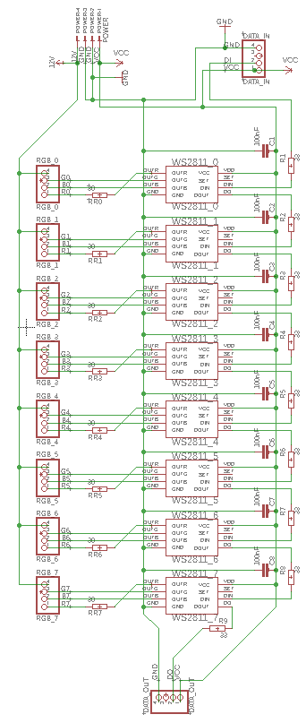

Aura sync splitter
===

Purpose
---
This schematic can be used for when one wants to use the an addressable WS2811 signal to power additional RGB components separately. These component groups will have their own dedicated PSU connection.

Setup
---
Include the `WS2811.lbr` library as a library in Eagle. This is the DIP8 version of the WS2811 IC.

Requirements
---

This board was made in Eagle, so it's a requirement to do anything with the source files. As for hardware, for one board, one needs:
* 8x WS2811 IC's, DIP8 format
* 10x 2.54 mm groups of 4 pins. Note that Aura Sync uses round pins instead of square ones, so it's up to the user to figure out how to connect their components.
* 9x 33 ohm resistors (R1 - R9) used to prevent reflection and hot-swap.
* 8x 100 nF capacitors used as bypass.
* Every connected component requires an additional resistor (RR0 - RR7). These are dependent on the component which is hooked up to it. The value of this resistor is described in the WS2811 datasheet, page 5.
* For easy connecting, a 4-pin molex connection would be handy, if one has the tools for it.

Usage
---

After everything is soldered, the 8 ports can be used to connect Aura Sync headers. The DATA_IN pins are to be connected to the motherboard's addressable LED pins and The molex goes to the PSU.

If more RGB is desired, one can use the DATA_OUT to chain these boards or to use the addressable RGB signal to a final component.

Disclaimer
---
Use at your own risk. If anything breaks, one only has himself to blame.