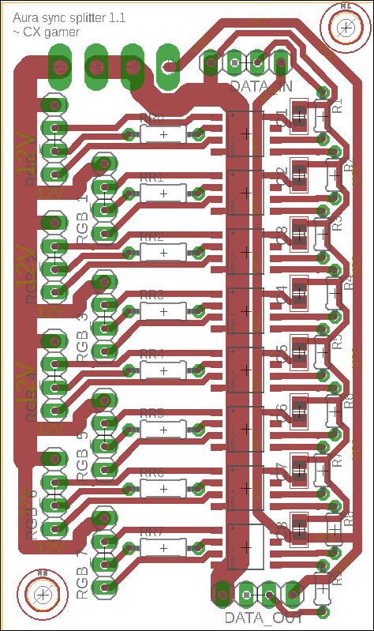
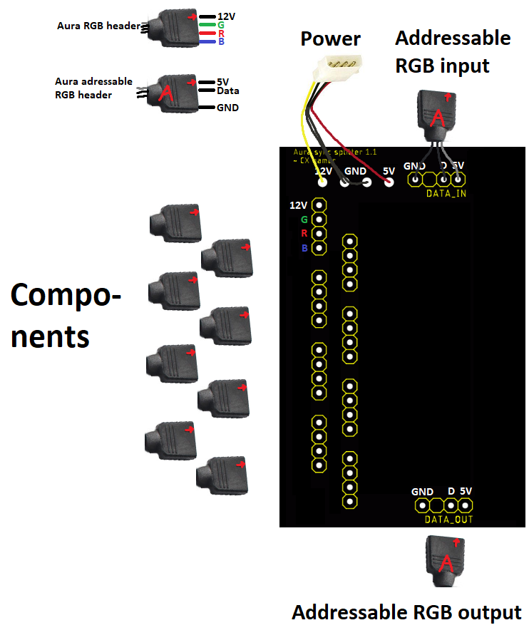

Aura sync splitter
===

Purpose
---
This schematic can be used for when one wants to use the an addressable WS2811B signal to power additional RGB components separately. These component groups will have their own dedicated PSU connection.

Setup
---
Include the `WS2811.lbr` library as a library in Eagle. This is the DIP8 version of the WS2811 IC.

Requirements
---

This board was made in Eagle, so it's a requirement to do anything with the source files. As for hardware, for one board, one needs:
* 8x WS2811 IC's, DIP8 format
* 9x 2.54 mm groups of 4 round pins.
* 9x 33 Ω resistors (R1 - R9) used to prevent reflection and hot-swap.
* 8x 100 nF capacitors used as bypass.
* Every connected component requires an additional resistor (RR0 - RR7). A 330 Ω  resistor should do, but these can be calculated as described in the included WS2811 datasheet, page 5.
* For easy connecting, a 4-pin male molex connection would be handy.

Usage
---

After everything is soldered, the 8 ports can be used to connect Aura Sync headers. The DATA_IN pins are to be connected to the motherboard's addressable LED pins and The molex goes to the PSU.

If more RGB is desired, one can use the DATA_OUT to chain these boards or to use the addressable RGB signal to a final component.

WARNING: Do not make mistakes. The two kinds of Aura headers are exactly the same, mixing them up may cause component failure. Triple check the PSU cables as well and measure the voltages before connecting the motherboard. Wrongly connecting those may damage your motherboard.

Known issues
---
* Aura sync headers are a little larger than there is room for on the board. One can safely sand away a little bit of plastic to make it fit.
* Some addressable RGB headers don't have a hole for a dummy PIN. If using 4 PINs at the DATA_OUT header, you can safely remove the unused one (2nd from the left).

Versions
---
1.1: Fixed the color PIN order. ASUS uses the WS2811B which uses GRB instead of our WS2811's RGB. Also made some more room to solder the resistor.
1.0: Initial version

Disclaimer
---
Use at your own risk. If anything breaks, one only has himself to blame.
